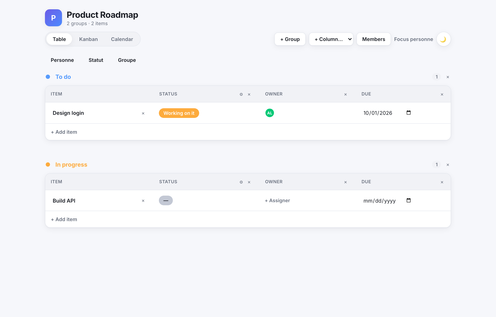
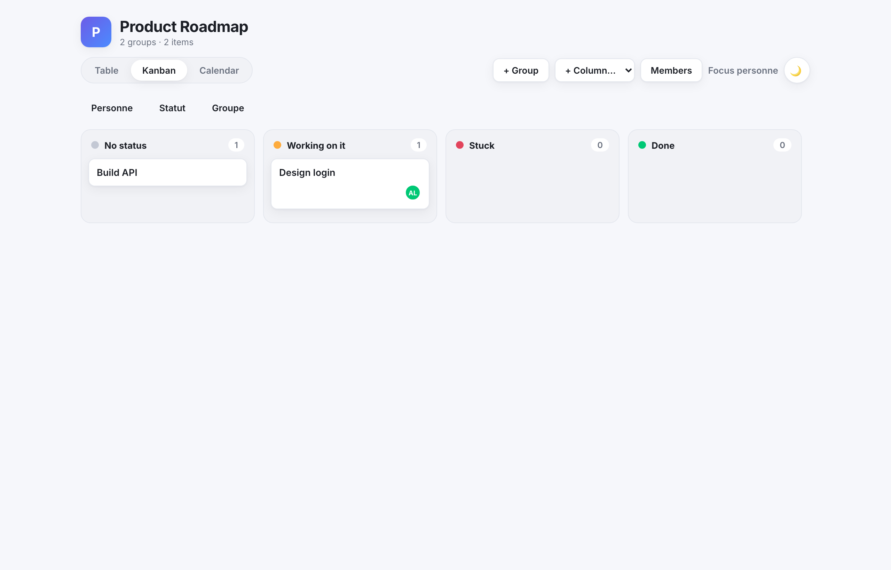
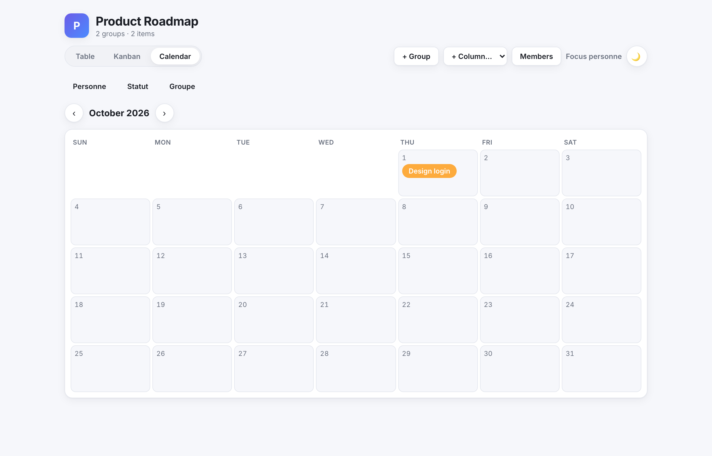
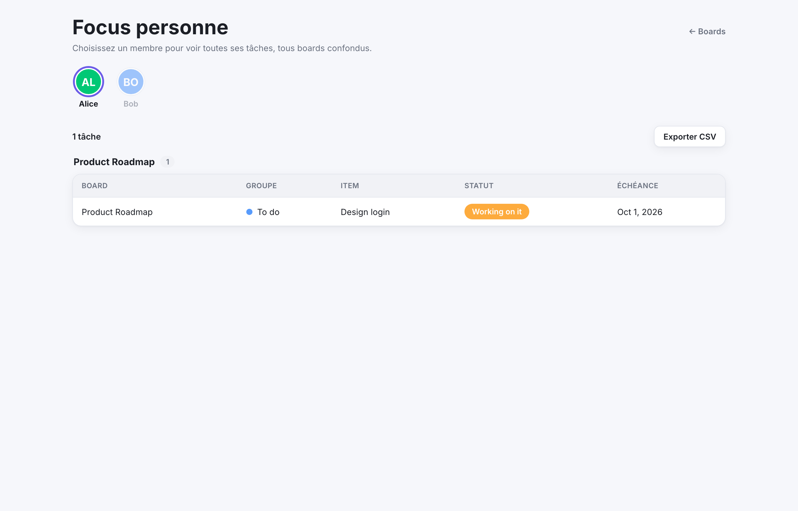
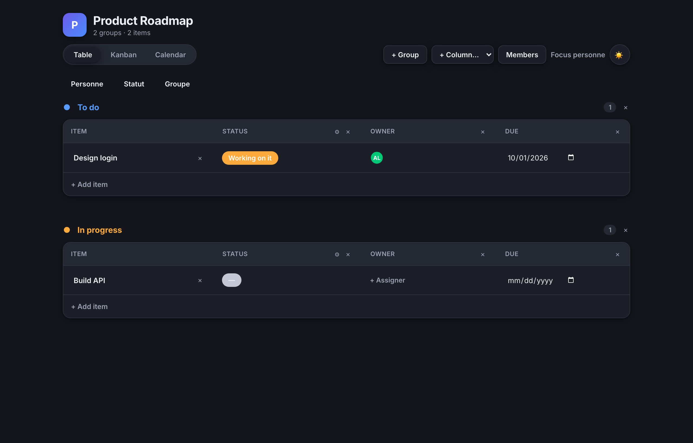
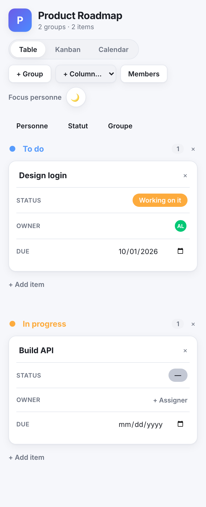

# Monday Clone

A self-hosted, Docker-deployable work-management app inspired by Monday.com — boards with
typed columns and **Table / Kanban / Calendar** views. Runs on a VPS or locally with one command.

> Per-user accounts with roles (Admin / Member / Viewer) — no shared password. Ideal for a
> trusted team behind HTTPS. See the [roadmap](#roadmap).

## Screenshots

| Table view | Kanban board |
| --- | --- |
|  |  |
| **Calendar** | **Focus personne (cross-board My Work)** |
|  |  |

Dark mode and mobile (the table becomes stacked cards):

| Dark theme | Mobile |
| --- | --- |
|  |  |

<sub>Regenerate with the app running: `npm i -D playwright && npx playwright install chromium && node scripts/screenshots.mjs`.</sub>

## Features

- **Boards** → groups → items → **typed columns**: text, status, person, date, number,
  dropdown/priority, checkbox, timeline, files, link, tags
- **Three views** over the same data: editable **Table** (sticky first column), drag-and-drop
  **Kanban** (drag a card to change its status), and **Calendar** (by date/timeline column)
- **Board filters** by Person / Status / Group, combinable, applied across all three views
- **Focus personne (cross-board My Work view + CSV export)** — pick a member at `/people` to
  see all their items across every board, with a one-click CSV export
- **Colored status chips**, **avatar assignees**, editable status/dropdown labels
- **File uploads** stored on a local volume
- **Per-user accounts + roles**: real email/password login (scrypt-hashed, no shared instance
  password), three global roles — **Admin** (full control + user management), **Member**
  (edits item content), **Viewer** (read-only) — permissions enforced server-side on every
  route, plus an admin-only Users panel and login/logout
- **Light / dark theme** (follows system, toggle persists) and a **responsive** UI —
  the table becomes stacked cards on mobile, no horizontal overflow
- Full CRUD from the UI: create/rename/delete boards, groups, columns, items

## Quick start (Docker)

```bash
git clone <this-repo-url> monday-clone
cd monday-clone
cp .env.example .env          # then edit .env — set ADMIN_PASSWORD and SESSION_SECRET
docker compose up -d --build
docker compose exec app npm run db:seed   # optional: demo board
```

Open **http://localhost:3000** and sign in with the bootstrapped admin (see below).

> Port 3000 already taken? In `docker-compose.yml` (service `app`) change `"3000:3000"` to
> `"4000:3000"`, then `docker compose up -d`. App is then on http://localhost:4000.

### First run / admin

On first container start (no accounts exist yet), `scripts/bootstrap-admin.mjs` creates one
admin account from `ADMIN_EMAIL` / `ADMIN_PASSWORD`. Sign in with those credentials, then use
the **Users** panel in the app to create accounts for the rest of the team and assign roles —
there is no public signup. The bootstrap step is a no-op once any account exists, so it's safe
to leave `ADMIN_EMAIL`/`ADMIN_PASSWORD` in `.env` permanently.

## Configuration

| Var | Meaning | Default |
| --- | --- | --- |
| `DATABASE_URL` | PostgreSQL connection string | `postgresql://monday:monday@db:5432/monday?schema=public` |
| `ADMIN_EMAIL` | Email for the bootstrapped first admin account (bootstrap/seed only) | `admin@example.com` |
| `ADMIN_PASSWORD` | Password for the bootstrapped first admin account (bootstrap/seed only) | `change-me-admin` — **change it** |
| `SESSION_SECRET` | Cookie signing secret (long random) | generate one |
| `UPLOAD_DIR` | File storage path | `/data/uploads` |
| `MAX_UPLOAD_BYTES` | Max upload size (bytes) | `10485760` (10 MB) |

`APP_PASSWORD` (v1.x) has been removed — there is no shared instance password anymore, only
individual accounts.

Generate a secret: `openssl rand -base64 32`.
**Before exposing publicly**, change `ADMIN_PASSWORD` and set a real `SESSION_SECRET`, and put
an HTTPS reverse proxy in front (see the manual).

## Documentation

- **[User & admin manual (MANUAL.md)](MANUAL.md)** — full guide: usage, configuration,
  backups, updates, VPS deployment, troubleshooting, architecture.
- **[Specification (docs/SPECIFICATION.md)](docs/SPECIFICATION.md)** — current-state spec:
  scope, architecture, data model, auth/roles, API surface. The source of truth.
- **[Changelog (CHANGELOG.md)](CHANGELOG.md)** — version history (v1.0 → v2.0).
- **[Deploy guide (docs/DEPLOY.md)](docs/DEPLOY.md)** — host on a VPS behind Nginx Proxy Manager
  (scripts: `scripts/deploy.sh`, `scripts/setup-npm-proxy.sh`).
- **[docs/](docs/README.md)** — how the documentation base is organized (living docs vs
  historical iteration records).
- **[TODO.md](TODO.md)** — backlog / roadmap.

## Testing

Unit + integration: `npm test` (Vitest). End-to-end UI (role-based flows) against a running
app: `npm i -D playwright && npx playwright install chromium`, then `npm run e2e` (see
`e2e/smoke.mjs`; it self-provisions and cleans up its own test users).

## MCP server (drive it from Claude)

A standalone [Model Context Protocol](https://modelcontextprotocol.io) server in
[`mcp/`](mcp/) lets Claude (Desktop / Code) drive the app in natural language — list boards,
add tasks, set status/assignee/dates, manage users, query who works on what. It talks to the
REST API and authenticates by logging in with a configured account (its role governs
permissions). See [`mcp/README.md`](mcp/README.md) for setup and the `mcp.json` snippet.

## Local development

```bash
docker compose up -d db          # just PostgreSQL
cp .env.example .env             # point DATABASE_URL at localhost:5432
npx prisma migrate deploy
npm install
npm run db:seed
npm run dev                      # http://localhost:3000
```

Tests: `npm test` · Types: `npx tsc --noEmit` · Build: `npm run build`.

## Tech stack

Next.js (App Router) · React · TypeScript · Prisma · PostgreSQL · Docker Compose.
Cell values are stored as JSON, validated per column type. See MANUAL.md § Architecture.

## Data & backups

Data lives in Docker volumes `pgdata` (database) and `uploads` (files). `docker compose down`
keeps them; `down -v` deletes them. Backup commands are in the manual.

## Roadmap

Done: board filters, cross-board person activity view, **per-user accounts + roles
(Admin/Member/Viewer)**. Pending: per-board permissions, password-reset/invite flow,
automations, real-time (websockets), row/column drag-reorder, image avatars, full-text search.
Contributions welcome.

## License

[MIT](LICENSE) © Pierre De Dobbeleer
